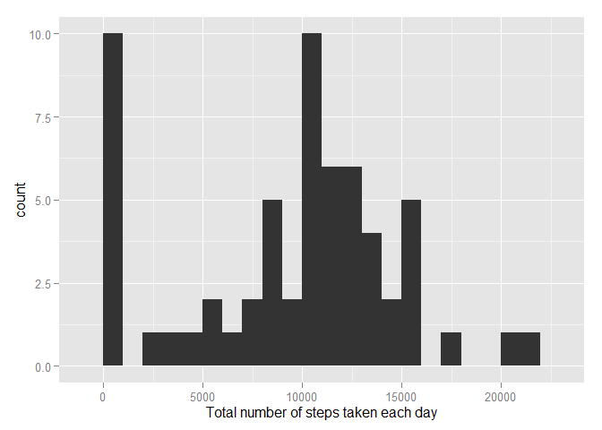
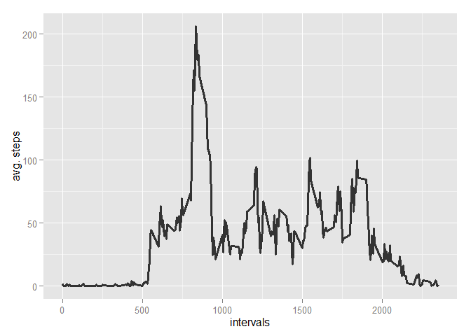
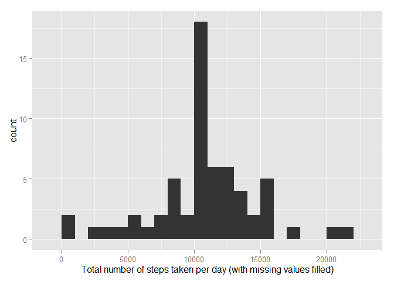
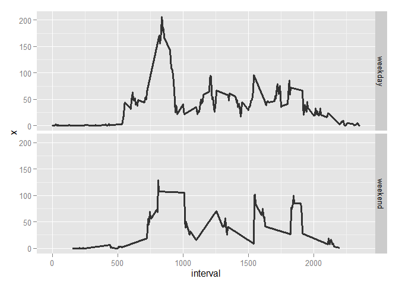

# Reproducible Research: Peer Assessment 1

## Loading and preprocessing the data

After unzipping the given file, load the `csv` file:


```r
activity <- read.csv('data/activity.csv')
```

And preprocess the data given the questions we want to answer, in this case recognizing the `date` variable as date in order to use the `weekdays()` function in question 5 (could also be done later on).


```r
activity$date <- as.Date(activity$date)
```


## What is mean total number of steps taken per day?

1. Histogram of the total number of steps taken each day


```r
library(ggplot2)
stepsPerDay <- aggregate(activity$steps, by=list(Day = activity$date), FUN = sum, na.rm = T)
qplot(stepsPerDay$x, binwidth = 1000, xlab = "Total number of steps taken each day")
```

 

2. Calculate and report the **mean** and **median** total number of steps taken per day


```r
stepsMean <- mean(stepsPerDay$x, na.rm = T)
stepsMedian <- median(stepsPerDay$x, na.rm = T)
```

The mean is **9354.23** and the median is **10395**.

## What is the average daily activity pattern?

1. Make a time series plot (i.e. `type = "l"`) of the 5-minute interval (x-axis) and the average number of steps taken, averaged across all days (y-axis)


```r
avgStepsPerInterval <- aggregate(x=list(meanSteps=activity$steps), by=list(interval=activity$interval), FUN=mean, na.rm=TRUE)
ggplot(data=avgStepsPerInterval, aes(x=interval, y=meanSteps)) +
  geom_line(colour="#333333", size = 1.1) + 
  xlab("intervals") +
  ylab("avg. steps")
```

 

2. Which 5-minute interval, on average across all the days in the dataset, contains the maximum number of steps?


```r
maxSteps <- avgStepsPerInterval[which(avgStepsPerInterval$meanSteps == max(avgStepsPerInterval$meanSteps)), ]
```

The interval with the maximum number of steps (an avg. of 206.1698) is **835**.

## Imputing missing values

1. Calculate and report the total number of missing values in the dataset


```r
naValues <- length(which(is.na(activity$steps)))
```

The total number of missing values (`NA` values) in the dataset is **2304**.

2. Devise a strategy for filling in all of the missing values in the dataset

Missing values will be filled with the mean steps for each interval where a missing value exists. To achieve that, a temporary dataframe will be generated with an additional column containing the mean number of steps for the corresponding interval.


```r
temp <- merge(activity, avgStepsPerInterval, by ="interval")
```

3. Create a new dataset that is equal to the original dataset but with the missing data filled in

Then, still in the temporary dataframe, the steps column is filled with the mean steps if the original value is missing, and then the extra `meanSteps` column is removed to get a dataset the same as the original but with missing values filled in.


```r
temp$steps <- ifelse(is.na(temp$steps), temp$meanSteps, temp$steps)
activityFilled <- temp[,1:4]
```

4. Make a histogram of the total number of steps taken each day

The same histogram as for question 1 is drawn, but with filled data:


```r
stepsPerDayFilled <- aggregate(activityFilled$steps, by=list(Day = activityFilled$date), FUN = sum, na.rm = T)
qplot(stepsPerDayFilled$x, binwidth = 1000, xlab = "Total number of steps taken per day (with missing values filled)")
```

 

5. Calculate and report the **mean** and **median** total number of steps taken per day.


```r
stepsMeanF <- mean(stepsPerDayFilled$x, na.rm = T)
stepsMedianF <- median(stepsPerDayFilled$x, na.rm = T)
```

After filling missing values, the mean is **10766.19** and the median is **10766.19**.

So, to sum up,

|        | With NAs                | Without NAs              |
|--------|-------------------------|--------------------------|
| mean   | 9354.23   | 10766.19   |
| median | 10395 | 10766.19 |

the values do differ slightly, specially regarding the mean. Also, after filling missing values, mean and median are the same.

## Are there differences in activity patterns between weekdays and weekends?

1. Create a new factor variable in the dataset with two levels -- "weekday" and "weekend" indicating whether a given date is a weekday or weekend day


```r
dayType <- function(x) {
  switch(x,
         'lunes'='weekday',
         'martes'='weekday',
         'miércoles'='weekday',
         'jueves'='weekday',
         'viernes'='weekday',
         'sábado'='weekend',
         'domingo'='weekend')
}
activityFilled$weekend = sapply(weekdays(activity$date), dayType)
```

2. Make a panel plot containing a time series plot of the 5-minute interval (x-axis) and the average number of steps taken, averaged across all weekday days or weekend days (y-axis). 


```r
activityFilledDailyMean <- aggregate(activityFilled$steps, by = list(interval=activityFilled$interval, weekend=activityFilled$weekend), mean)

ggplot(activityFilledDailyMean, aes(interval,x) ) +
  geom_line(colour="#333333", size = 1.1) +
  facet_grid(weekend ~ .)
```

 

There are slight differences between weekdays and weekends, with the former getting more steps in the earliest hours of the day (possibl due to commutes to work) and weekends having more _rest_ periods.
